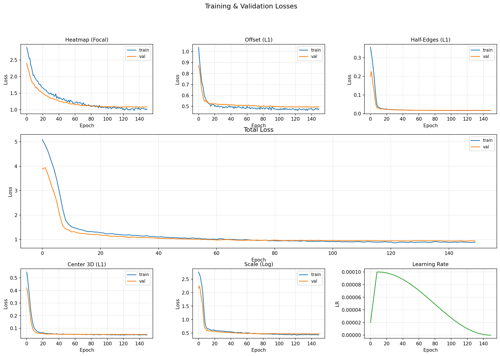
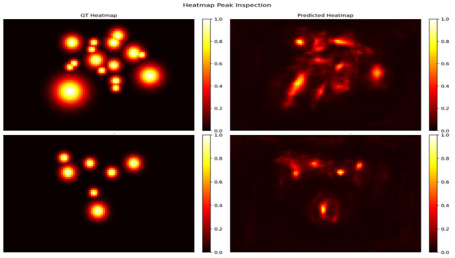
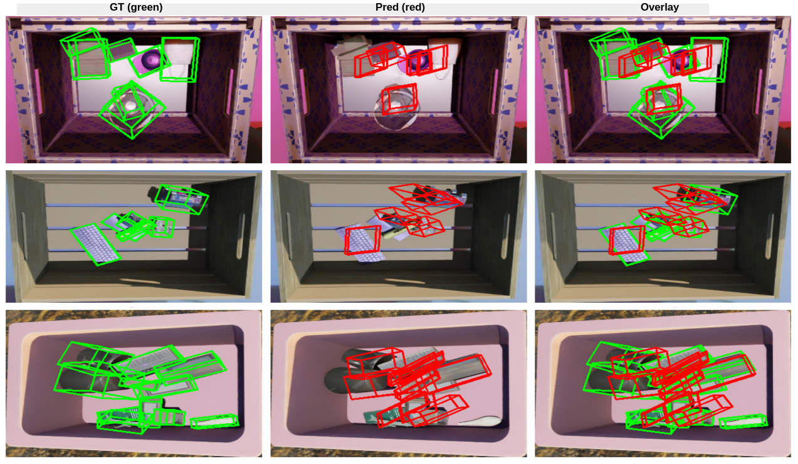

# 3D Bounding Box Prediction

This project builds a full deep learning pipeline for predicting 3D bounding boxes from RGB images and organized point clouds. The model takes in an image and its corresponding per-pixel depth data, detects objects, and outputs oriented 3D cuboids around each one. Everything runs end-to-end from raw data to ONNX-exported inference, including training, evaluation, visualization, and model conversion.

The architecture follows a CenterNet-style approach where object centers are detected on a heatmap, and per-center regression heads predict the 3D geometry (half-edge vectors and 3D center coordinates). A dual-stream design fuses RGB appearance features with point cloud geometry before the detection heads. The model was trained and tested on a GTX 1650 with 4 GB VRAM using only 200 samples, so the focus was on making the most of a small dataset through heavy augmentation and careful loss design.


## Quick Start

```bash
# 1. clone the repo
git clone https://github.com/LoqmanSamani/jobq.git
cd jobq

# 2. set up the environment (Python 3.12)
python3 -m venv .venv
source .venv/bin/activate
pip install torch torchvision --index-url https://download.pytorch.org/whl/cu126
pip install timm opencv-python-headless matplotlib scipy pillow onnx onnxruntime onnxscript pytest

# 3. run the test suite (184 tests)
python3 -m pytest tests/ -v

# 4. run the full pipeline (train + eval + export + visualize)
#    first place your data under data/ and update src/config.py paths
python3 -m pipelines.pipeline_

# 5. run inference only (uses a trained checkpoint)
python3 -m pipelines.infer --checkpoint outputs/checkpoints/best.pt --data_dir data/
```


## Data

200 samples, each stored in its own directory with 4 files:

| File        | Shape        | Description                                            |
| ----------- | ------------ | ------------------------------------------------------ |
| `rgb.jpg`   | (H, W, 3)   | RGB image                                              |
| `pc.npy`    | (3, H, W)   | Organized point cloud, XYZ per pixel                   |
| `bbox3d.npy`| (N, 8, 3)   | 3D bounding box corners, 8 vertices in world coords    |
| `mask.npy`  | (N, H, W)   | Per-instance binary segmentation masks                 |

The data is not included in this repo. To reproduce the results, place your own data in `data/` with the same format.

**Hardware used for all experiments:**

    CPU: Intel i5-9300HF (8 threads @ 2.4 GHz)
    GPU: NVIDIA GTX 1650 (4 GB VRAM)
    RAM: 16 GB


## Pipeline Overview

Data goes through three stages: preprocessing, training, and inference. Raw samples are resized and augmented, converted into training targets, batched into data loaders, and fed into the network. After training, the model is evaluated on a held-out test set and exported to ONNX format.

### Preprocessing

**1. Resize** all samples to a fixed (256, 384) shape.
- Image: bilinear interpolation. This resolution was chosen because of the 4 GB VRAM constraint, and its 3:2 aspect ratio is close to the dataset mean.
- Point cloud: bilinear interpolation (XYZ values are continuous).
- Masks: nearest-neighbor interpolation to keep binary edges crisp.

**2. Augmentation and normalization.** With only 160 training samples, augmentation is essential. Applied in this order:
- Random horizontal flip (p=0.6): flips image and masks, negates point cloud x-axis for geometric consistency.
- Random scale crop (scale 1.0-1.25, p=0.5): scales up then center-crops back to original size.
- Random color jitter: random changes to brightness, contrast, and saturation.
- Random Gaussian noise (p=0.4): added to both image and point cloud independently.
- Random erasing (p=0.4): cutout-style rectangular region erasure on the image.
- Normalization: ImageNet mean/std for the image, per-channel standardization for the point cloud.

**3. Training targets** generated per sample:
- **Heatmap** (1, 64, 96): a Gaussian peak stamped at each object's mask centroid on the stride-4 feature map. The model's sigmoid output is compared against this using focal loss, which down-weights the overwhelming background pixels.
- **Offset** (2 values per object): the fractional part of the centroid after stride-4 downsampling, capturing the sub-pixel residual. Supervised with L1 loss at GT center locations only.
- **Half-edges** (9 values per object): three half-edge vectors from corner 0 to corners 1, 3, 4, each with 3 coordinates, encoding box shape and orientation. These are canonicalized (sorted by magnitude, sign-flipped) to remove the 48-fold permutation/sign ambiguity. Supervised with L1 loss plus a log-scale loss on vector magnitudes to prevent collapse toward cubic shapes.
- **Center 3D** (3 values per object): the mean of all 8 cuboid corners in world coordinates. Supervised with L1 loss at GT center locations.


### Model Architecture

The model is a CenterNet-style dual-stream network. I chose CenterNet as the base because it is anchor-free, which avoids the need to define anchor boxes for 3D objects (where shapes and orientations vary a lot). It also naturally outputs dense per-pixel predictions, making it straightforward to add geometry heads on top.

```
            RGB image (b, 3, 256, 384)         Point cloud (b, 3, 256, 384)
                    |                                      |
            ResNet-18 backbone                    Point-cloud encoder
            (ImageNet pretrained)              (3 conv layers -> 64ch @ stride 4)
                    |                                      |
                FPN neck                                   |
            (64ch @ stride 4)                              |
                    |                                      |
                    +------------ concat + fuse -----------+
                                    |
                            Cross-modal fusion
                                (128 -> 64ch)
                                    |
                            +---------+---------+
                            |                   |
                    Classification        Geometry
                    branch (3x3)          branch (3x3)
                            |                   |
                    +-----+-----+       +----+----+
                    |           |       |         |
                Heatmap     Offset  Regression  Center3D
                (1ch)      (2ch)    (9ch)       (3ch)
```

**Why each component matters:**

- **ResNet-18 backbone**: pretrained on ImageNet, gives strong low-level features with minimal compute. Layer 1 is frozen to prevent overfitting on the small dataset.
- **Point-cloud encoder**: three convolutional layers that downsample the organized point cloud to stride 4 and extract 64-channel depth features. This gives the model direct access to 3D geometry.
- **FPN neck**: merges multi-scale backbone features (layers 1-4) into a single stride-4 map via top-down lateral connections. This lets the model detect both small and large objects.
- **Cross-modal fusion**: concatenates the RGB FPN output and point cloud features (128 channels), then fuses them with a 1x1 convolution back to 64 channels. Combining appearance and depth improves localization.
- **Classification vs. geometry branches**: a 3x3 conv splits the fused features into two streams. The classification branch feeds the heatmap and offset heads (where is the object?). The geometry branch feeds the regression and center_3d heads (what shape is it and where in 3D?). This separation lets each branch specialize.
- **Geometry conditioning**: the regression and center_3d heads receive extra inputs, normalized (u, v) pixel coordinates and downsampled point cloud values, concatenated to the geometry features. This gives the heads per-pixel spatial and depth context, which helps predict accurate 3D coordinates.
- **Detection heads**: each is a stack of three 3x3 conv layers with BatchNorm, ReLU, and dropout, followed by a 1x1 output conv.

The four output maps at stride 4 (64x96 for a 256x384 input):

| Head       | Channels | Output                                    |
| ---------- | -------- | ----------------------------------------- |
| Heatmap    | 1        | Object center probability                 |
| Offset     | 2        | Sub-pixel center refinement (dy, dx)      |
| Regression | 9        | 3 half-edge vectors x 3 coordinates       |
| Center 3D  | 3        | 3D object center (x, y, z)                |


### Loss Functions

The total loss is a weighted sum of five components. Each one targets a different aspect of the prediction.

**Heatmap focal loss.** Standard focal loss adapted for dense heatmap regression. The positive (peak) pixels are rare compared to the negative (background) pixels, so vanilla cross-entropy would be dominated by easy negatives. Focal loss fixes this by adding a modulating factor that reduces the loss contribution from well-classified pixels. The formula is:

$$L_{focal} = \frac{1}{N} \sum_{ij} \begin{cases} -(1 - \hat{p}_{ij})^\alpha \log(\hat{p}_{ij}) & \text{if } y_{ij} = 1 \\ -(1 - y_{ij})^\beta (\hat{p}_{ij})^\alpha \log(1 - \hat{p}_{ij}) & \text{otherwise} \end{cases}$$

where $\hat{p}$ is the predicted probability (after sigmoid), $y$ is the ground truth heatmap, $\alpha=2$ controls how much easy examples are down-weighted, and $\beta=4$ reduces the penalty near but not at GT peaks.

**Offset L1 loss.** L1 loss on the predicted sub-pixel offsets at GT center locations. Because the stride-4 downsampling quantizes center positions to integer grid cells, the offset head learns to predict the fractional residual. L1 is used because it gives constant gradients regardless of error magnitude, which is helpful for small corrections.

**Half-edge L1 loss.** L1 loss on the 9 predicted half-edge values at GT center locations. This directly supervises the direction and magnitude of the three box-defining vectors. L1 is preferred over L2 here because it is less sensitive to outliers, and the canonicalization already removes ambiguity, so the targets are clean.

**Center 3D L1 loss.** L1 loss on the predicted (x, y, z) world coordinates of the object center. Same reasoning as offset loss: constant gradients work well for coordinate regression.

**Half-edge scale loss.** A log-space magnitude loss that compares log(||h_pred||) to log(||h_gt||) for each of the 3 half-edge vectors. Without this, the flat L1 loss produces near-zero gradients for thin dimensions (because the absolute error is small even when the ratio is way off), and the model collapses predictions toward cubic shapes. Working in log-space makes the gradient proportional to the relative error rather than the absolute error, so thin and thick dimensions get equal attention.


### Evaluation Metrics

The model is evaluated with five metrics, each capturing a different quality aspect. Predictions are matched to ground truth boxes using the Hungarian algorithm with a center-distance threshold of 0.5.

- **Mean corner error**: average L2 distance across all 8 corners (with optimal corner assignment via the Hungarian algorithm). This is the most comprehensive geometric metric because it measures how well the full 3D shape aligns with the ground truth, including position, orientation, and size all at once.

- **Mean center error**: L2 distance between the predicted and GT box centers (mean of 8 corners). Measures pure localization quality independent of shape accuracy.

- **3D IoU**: intersection-over-union computed on the convex hulls of predicted and GT boxes using halfspace intersection. This is the standard volumetric overlap metric for 3D detection. It penalizes both localization and shape errors together, giving a single number for overall detection quality.

- **Mean size error**: L1 error on the box dimensions (length, width, height), computed via SVD on the centered corners. This isolates shape accuracy from position errors, showing whether the model gets the proportions right even if the box is shifted.

- **Precision and recall**: precision = TP / (TP + FP), recall = TP / (TP + FN), where matches are determined by center distance. Precision tells us how many of the model's detections are actually correct, while recall tells us how many of the actual objects are found.


## Results

The model was trained for 150 epochs (~41 minutes) with the hyperparameters defined in `src/config.py`. Key settings: batch size 4 with 4 gradient accumulation steps (effective batch 16), learning rate 1e-4 with 10-epoch linear warmup and cosine decay, early stopping patience of 30 epochs.

### Test Set Metrics (20 samples)

| Metric              | Value  |
| ------------------- | ------ |
| Mean corner error   | 0.119  |
| Mean center error   | 0.100  |
| Mean 3D IoU         | 0.077  |
| Mean size error     | 0.031  |
| Precision           | 0.889  |
| Recall              | 0.847  |
| True positives      | 216    |
| False positives     | 27     |
| False negatives     | 39     |

Precision and recall are both solid given the dataset size. The model finds most objects (85% recall) and most of its detections are correct (89% precision). The mean center error of 0.10 indicates the model localizes object centers in 3D reasonably well. The relatively low 3D IoU (0.077) is expected. 3D IoU is extremely sensitive to even small orientation or size mismatches, and with only 160 training samples the model cannot perfectly learn all shape variations.

### Loss Curves



All five loss components and the total loss decrease smoothly and converge by around epoch 60-80. The train and validation curves track each other closely throughout, with almost no gap between them. This means the model is not overfitting, which is a direct result of the augmentation strategy and the dropout/regularization setup. The scale loss starts highest (around 2.5-2.7) and drops quickly in the first 20 epochs, indicating the model rapidly learned to predict box proportions in log-space. The learning rate schedule shows the 10-epoch warmup followed by cosine decay, reaching near zero by epoch 150.

### Heatmap Predictions



The left column shows GT heatmaps with clean Gaussian peaks at each object center. The right column shows the model's predictions. The model generally activates in the right regions and identifies most object locations. However, the predicted peaks are broader and less sharp than the GT, and some weaker objects are missed or merged. This is consistent with the recall of 0.847, where about 15% of objects are not detected. Some false activations (diffuse warm areas without a corresponding GT peak) contribute to the 27 false positives.

### 3D Bounding Box Predictions



Green wireframes are ground truth, red wireframes are predictions, and the rightmost column overlays both. For the top row (fewer, larger objects), the predicted boxes align fairly well with the GT in both position and orientation. In the middle row, the model captures the general layout of objects on a shelf but shows some size and orientation mismatches. The bottom row (densely packed scene) is the hardest, where predictions overlap heavily and the model struggles to separate individual objects. This pattern makes sense: with more objects in a scene, the heatmap peaks crowd together and become harder to distinguish.

### Summary and Limitations

The model achieves reasonable detection performance for a system trained on only 160 samples with a 4 GB GPU. The main takeaways:

- **What works well**: center localization (precision 89%, recall 85%), size estimation (mean error 0.031), and generalization (no overfitting on the loss curves).
- **Where it struggles**: 3D IoU is low because small rotation or scale errors cause large volume mismatches, and densely packed scenes degrade detection quality.
- **What could help**: more training data would be the single biggest improvement. Beyond that, adding rotation-aware loss terms, using a larger backbone (if VRAM allows), and applying test-time augmentation could all push accuracy further. Training with a learning rate finder instead of a fixed schedule might also help.


## Directory Structure

```
jobq/
├── src/
│   ├── config.py               # central hyperparameter configuration
│   ├── dataset.py              # dataset class + dataloader builder
│   ├── transforms.py           # augmentation and normalization
│   ├── model.py                # BBox3DNet architecture
│   ├── losses.py               # all loss components
│   ├── trainer.py              # training loop with early stopping
│   ├── evaluator.py            # evaluation metrics and matching
│   ├── inference.py            # predictor class for single-sample inference
│   ├── utils.py                # utilities (IoU, NMS, ONNX export, etc.)
│   └── visualize.py            # loss curves, wireframes, BEV, heatmaps
├── pipelines/
│   ├── pipeline_.py            # full end-to-end pipeline
│   ├── train.py                # training only
│   └── infer.py                # inference + evaluation + export + viz
├── tests/                      # pytest test suite (184 tests)
│   ├── test_config.py
│   ├── test_dataset.py
│   ├── test_evaluator.py
│   ├── test_inference.py
│   ├── test_losses.py
│   ├── test_model.py
│   ├── test_trainer.py
│   ├── test_transforms.py
│   └── test_visualize.py
├── data/                       # sample directories (not tracked in git)
│   └── <uuid>/
│       ├── rgb.jpg
│       ├── pc.npy
│       ├── bbox3d.npy
│       └── mask.npy
├── outputs/                    # experiment results
│   ├── checkpoints/            # best.pt model checkpoint
│   ├── train/                  # training history (history.json)
│   ├── eval/                   # test metrics and per-sample results
│   ├── onnx/                   # ONNX and FP16 ONNX exports
│   └── visualizations/         # loss curves, wireframes, BEV, heatmaps
└── README.md
```


## Dependencies

| Package                | Version      | Used In                              |
| ---------------------- | ------------ | ------------------------------------ |
| Python                 | 3.12.3       | runtime                              |
| torch                  | 2.11.0+cu126 | model, training, inference, losses   |
| numpy                  | 2.4.3        | data processing, evaluation, viz     |
| timm                   | 1.0.26       | pretrained ResNet-18 backbone        |
| opencv-python-headless | 4.13.0.92    | image I/O, resize, visualization     |
| matplotlib             | 3.10.8       | loss curve plots, heatmap viz        |
| scipy                  | 1.17.1       | 3D IoU (ConvexHull), Hungarian match |
| pillow                 | 12.1.1       | image loading (dataset)              |
| onnx                   | 1.21.0       | model export, FP16 conversion        |
| onnxruntime            | 1.24.4       | ONNX inference validation            |
| onnxscript             | 0.6.2        | torch.onnx.export (PyTorch 2.x dep)  |
| pytest                 | 9.0.2        | test suite (184 tests)               |
